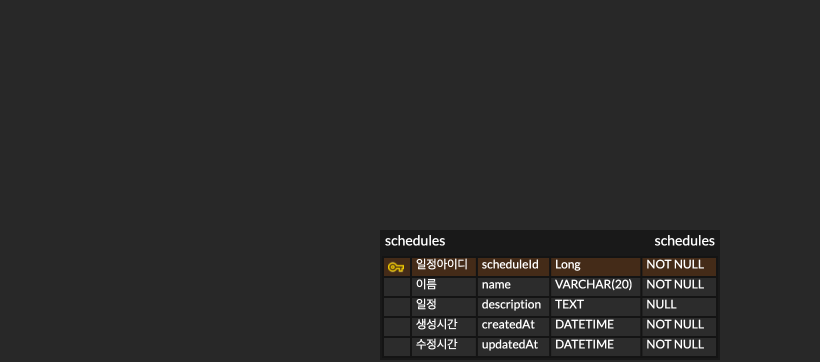

# API 명세서

## 일정관리 API
| 기능     | 메서드    | URL                          | 요청형식 | 응답형식 | 상태코드      
|--------|--------|------------------------------|------|------|-----------|
일정등록   | POST   | /api/schedules               | json | json | 201: 정상등록 , 400: 잘못된요청
전체일정조회 | GET    | /api/schedules               | x    | json | 200: 정상조회 , 404: 잘못된요청
특정일정조회 | GET    | /api/schedules/{scheduleId}  | x    | json | 200: 정상조회 , 404: 잘못된요청
일정수정   | PUT    | /api/schedules/{scheduleId} | json | json | 200: 정상수정 , 400: 잘못된요청
일정삭제   | DELETE | /api/schedules/{scheduleId} | json | x    | 200: 정상삭제 , 400: 잘못된요청 


## 1. POST 요청 본문
| 이름       | 타입     | 필수여부 | 
|----------|--------|-----|
 name (20자 제한)  | String | O   | 
 description  | String | X   |
 password      | String | O    |
### 1-1 일정 등록 요청예시
```
POST /api/schedules
{
    "name": "이름",
    "description": "일정내용",
    "password": "123"
}
```
### 1-2 일정 등록 응답예시
```
{
    "scheduleId": 1,
    "name": "이름",
    "description": "일정내용",
    "createdAt": "2024-11-03T12:01:42.296+00:00",
    "updatedAt": "2024-11-03T12:01:42.296+00:00"
}
```

## 2. GET
```
GET /api/schedules      // 전체일정조회

GET /api/schedules/{scheduleId}  // 특정일정조회
```
### 2-1 일정 조회 응답예시
```
{
    "scheduleId": 1,
    "name": "이름1",
    "description": "내용1",
    "createdAt": "2024-11-03T12:01:21.828+00:00",
    "updatedAt": "2024-11-03T12:01:21.828+00:00"
}
```
### 2-2 일정 전체 조회 응답예시
```
[
    {
        "scheduleId": 1,
        "name": "이름1",
        "description": "내용1",
        "createdAt": "2024-11-03T12:01:21.828+00:00",
        "updatedAt": "2024-11-03T12:01:21.828+00:00"
    },
    {
        "scheduleId": 2,
        "name": "이름2",
        "description": "내용2",
        "createdAt": "2024-11-03T12:01:36.499+00:00",
        "updatedAt": "2024-11-03T12:01:36.499+00:00"
    },
    {
        "scheduleId": 3,
        "name": "이름3",
        "description": "내용3",
        "createdAt": "2024-11-03T12:01:42.296+00:00",
        "updatedAt": "2024-11-03T12:01:42.296+00:00"
    }
]
```

## 3. PUT 요청 본문
| 이름       | 타입     | 필수여부 | 
|----------|--------|------|
 name  | String | O    |
 description  | String | X    |
password  | String | O    | 
### 3-1 일정 수정 요청예시
```
PUT /api/schedules/{scheduleId}
{
    "name": "이름바꾸자1",
    "description": "일정이바뀌었다1",
    "password": "123"
}
```
### 3-2 일정 수정 응답예시
```
{
    "scheduleId": 1,
    "name": "이름1111111",
    "description": "내용1111111",
    "createdAt": "2024-11-03T12:01:21.828+00:00",
    "updatedAt": "2024-11-03T12:12:39.423+00:00"
}
```


## 4. DELETE 요청 본문
| 이름       | 타입     | 필수여부 | 
|----------|--------|------|
 password  | String | O    |
### 4-1 일정 삭제 요청예시
```
DELETE /api/schedules/{scheduleId}
{
    "password": "123"
}       
```


# 일정 ERD



# SQL
## CREATE
```sql
-- schedules 테이블 생성
CREATE TABLE schedules (
    scheduleId Long          NOT NULL PRIMARY KEY AUTO_INCREMENT,
    createdAt  DATETIME NOT NULL,
    updatedAt  DATETIME NOT NULL,
    name       VARCHAR(20)  NOT NULL,
    description TEXT
);
```

## INSERT
```sql
-- Schedule 테이블에 데이터 삽입
INSERT INTO schedules (scheduleId, createdAt, updatedAt, name, description)
VALUES (1, now(), now(), '타이틀', '오늘의 일정은 이거다');
```

## SELECT
```sql
-- Schedule 테이블 전체 조회
SELECT * FROM schedules;

-- 특정 schedule_id 로 일정 조회
SELECT * FROM schedules
WHERE scheduleId = 1;
```

## UPDATE
```sql

-- 일정 수정
UPDATE schedules
SET name = '새로운 미팅', description = '업데이트된 일정'
WHERE scheduleId = 1;
```

## DELETE
```sql

-- 일정 삭제
DELETE FROM schedules
WHERE scheduleId = 1;
```
